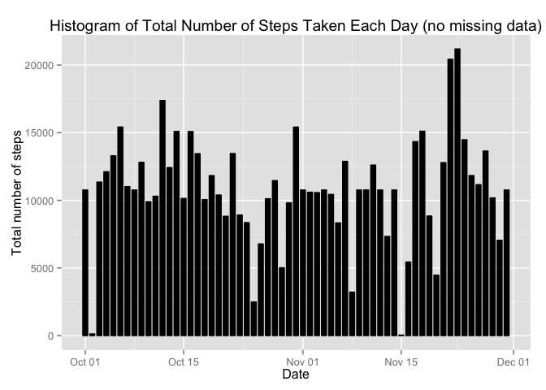

# Reproducible Research: Peer Assessment 1


# Loading and preprocessing the data
 Load the data (i.e. read.csv())

```r
download.file("https://d396qusza40orc.cloudfront.net/repdata%2Fdata%2Factivity.zip", destfile = "./Wearableactivity.zip")
unzip("./Wearabledata")
```

```
## Warning in unzip("./Wearabledata"): error 1 in extracting from zip file
```

```r
data <- read.csv("./activity.csv", colClasses = c("integer","Date","numeric"))
```
# Process/transform the data (if necessary) into a format suitable for analysis

```r
library(plyr)
library(dplyr)
```

```
## 
## Attaching package: 'dplyr'
```

```
## The following objects are masked from 'package:plyr':
## 
##     arrange, count, desc, failwith, id, mutate, rename, summarise,
##     summarize
```

```
## The following objects are masked from 'package:stats':
## 
##     filter, lag
```

```
## The following objects are masked from 'package:base':
## 
##     intersect, setdiff, setequal, union
```

```r
library(ggplot2)
```

```r
#This tranformation is only for the last steps: 
# Load the raw activity data
activity_raw <-  read.csv("./activity.csv", colClasses = c("integer","Date","numeric"))    
# Transform the date attribute to an actual date format
activity_raw$date <- as.POSIXct(activity_raw$date, format="%Y-%m-%d")

# Compute the weekdays from the date attribute
activity_raw <- data.frame(date=activity_raw$date, 
                           weekday=tolower(weekdays(activity_raw$date)), 
                           steps=activity_raw$steps, 
                           interval=activity_raw$interval)

# Compute the day type (weekend or weekday)
activity_raw <- cbind(activity_raw, 
                      daytype=ifelse(activity_raw$weekday == "saturday" | 
                                     activity_raw$weekday == "sunday", "weekend", 
                                     "weekday"))

# Create the final data.frame
activity <- data.frame(date=activity_raw$date, 
                       weekday=activity_raw$weekday, 
                       daytype=activity_raw$daytype, 
                       interval=activity_raw$interval,
                       steps=activity_raw$steps)
```
# What is mean total number of steps taken per day?
### Make a histogram of the total number of steps taken each day

```r
stepsdata <- group_by(data,date)
steps <- summarise(stepsdata, total = sum(steps,na.rm=TRUE))
totalnumberofsteps.plot <- ggplot(steps,aes(date,total)) + geom_bar(stat = "identity",color = "white", width = 1, fill = "black") + labs(y="Steps", x="Date", title = "Total Number of Steps Taken Each Day")
totalnumberofsteps.plot
```

\
## Calculate and report the mean and median total number of steps taken per day

```r
summary(steps$total)
```

```
##    Min. 1st Qu.  Median    Mean 3rd Qu.    Max. 
##       0    6778   10400    9354   12810   21190
```

# What is the average daily activity pattern?
##Make a time series plot (i.e. type = "l") of the 5-minute interval (x-axis) and the average number of steps taken, averaged across all days (y-axis)

```r
steps_rm_na<-filter(data,!is.na(steps))
stepsdata2<-group_by(steps_rm_na,interval)
steps2<-summarise(stepsdata2,average=mean(steps))
averagedailypattern.plot <- ggplot(data=steps2,aes(x=interval,y=average))+geom_line()+ labs(x ="Interval", y="Mean number of steps", title = "Average Steps By Interval")
averagedailypattern.plot
```

\
##Which 5-minute interval, on average across all the days in the dataset, contains the maximum number of steps?

```r
steps2[steps2$average == max(steps2$average),]
```

```
## Source: local data frame [1 x 2]
## 
##   interval  average
##      (dbl)    (dbl)
## 1      835 206.1698
```

## Imputing missing values
### Calculate and report the total number of missing values in the dataset (i.e. the total number of rows with NAs)

```r
sum(is.na(data))
```

```
## [1] 2304
```
## Devise a strategy for filling in all of the missing values in the dataset. The strategy does not need to be sophisticated. For example, you could use the mean/median for that day, or the mean for that 5-minute interval, etc.
### Create a new dataset that is equal to the original dataset but with the missing data filled in.

```r
data3 <- data 
for (i in 1:nrow(data3)) {
    if (is.na(data3$steps[i])) {
        data3$steps[i] <- steps2[which(data3$interval[i] == steps2$interval), ]$average
    }
}
```
### Display the first few rows of the new activity data frame:

```r
head(data3)
```

```
##       steps       date interval
## 1 1.7169811 2012-10-01        0
## 2 0.3396226 2012-10-01        5
## 3 0.1320755 2012-10-01       10
## 4 0.1509434 2012-10-01       15
## 5 0.0754717 2012-10-01       20
## 6 2.0943396 2012-10-01       25
```
# Make a histogram of the total number of steps taken each day and calculate and report the mean and median total number of steps taken per day. Do these values differ from the estimates from the first part of the assignment? What is the impact of imputing missing data on the estimates of the total daily number of steps?

```r
groupSteps3 <- group_by(data3, date)
steps3 <- summarise(groupSteps3,total=sum(steps))
ggplot(steps3,aes(date,total)) + geom_bar(stat="identity",color ="black",fill="black", width = 0.7)+ labs(title = "Histogram of Total Number of Steps Taken Each Day (no missing data)", x = "Date", y = "Total number of steps")
```

\
### Compute the mean and median.

```r
mean(data3$steps)
```

```
## [1] 37.3826
```

```r
median(data3$steps)
```

```
## [1] 0
```

# Are there differences in activity patterns between weekdays and weekends?
### Create a new factor variable in the dataset with two levels - “weekdays” and “weekend” indicating whether a given date is a weekday or weekend day.

```r
library(lattice)
library()
data$Weekend <- weekdays(data$date) == "Saturday" | weekdays(data$date) == "Sunday"
data$Weekend <- factor(data$Weekend, levels = c(F, T), labels = c("Weekday", "Weekend"))
activity <- ddply(data, .(interval, Weekend), summarize, steps = mean(steps, na.rm = T))
weekday_weekend.plot <- xyplot(steps ~ interval | Weekend, activity, type = "l", layout = c(1, 2), ylab = "Number of Steps", xlab = "Interval", main = "Time Series for Weekend and Weekday Activity Patterns")
weekday_weekend.plot
```

\
